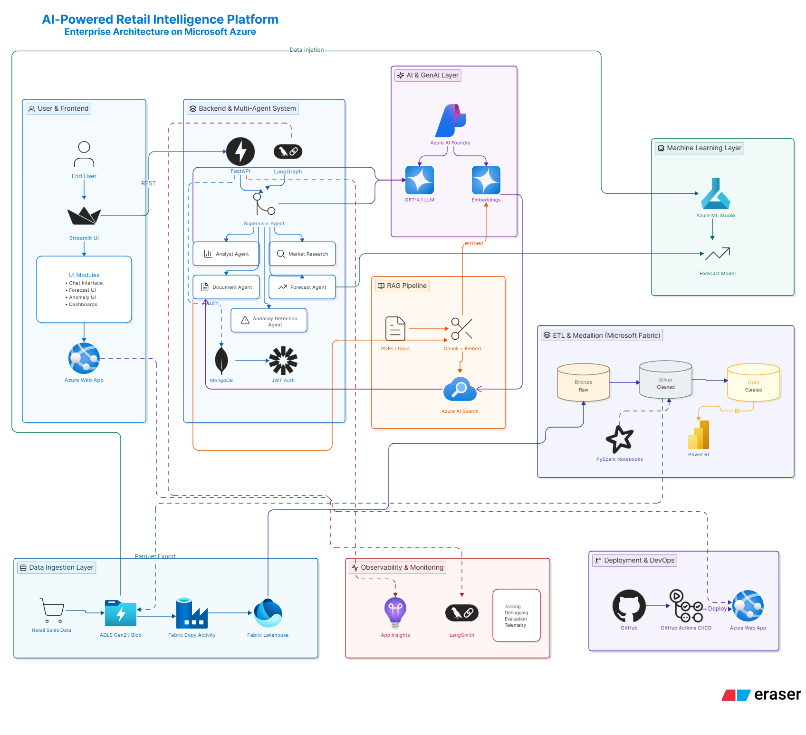
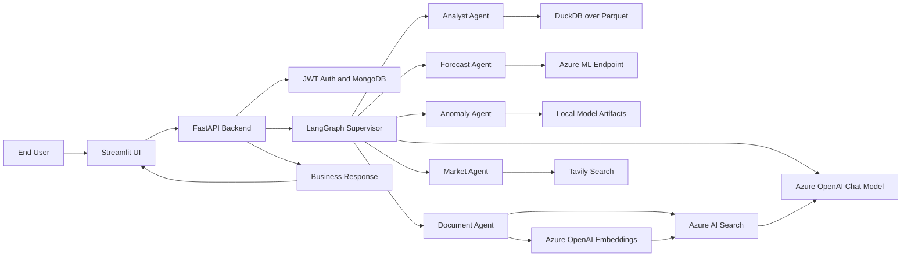

# IntelliRetail AI

AI-powered retail intelligence platform with a Streamlit frontend, FastAPI backend, LangGraph-based multi-agent orchestration, Azure OpenAI, Azure AI Search, Azure ML, MongoDB authentication, and retail analytics over Parquet data.



## Contents

- [Overview](#overview)
- [Core Features](#core-features)
- [Architecture](#architecture)
- [Workflow](#workflow)
- [Project Structure](#project-structure)
- [Prerequisites](#prerequisites)
- [Environment Variables](#environment-variables)
- [Setup](#setup)
- [Run the Project](#run-the-project)
- [API Endpoints](#api-endpoints)
- [Data and Models](#data-and-models)
- [Testing](#testing)
- [Deployment Notes](#deployment-notes)
- [Troubleshooting](#troubleshooting)

## Overview

IntelliRetail AI helps retail teams analyze sales data, detect anomalies, run demand forecasts, search internal documents, and gather market intelligence through a single protected dashboard.

The application is split into:

- `Frontend`: Streamlit UI for login, analytics chat, forecast, anomaly detection, document search, and document upload.
- `Backend`: FastAPI service that exposes protected APIs, orchestrates AI agents, connects to Azure services, and serves ML/RAG workflows.

## Core Features

- User authentication with signup, login, JWT cookie handling, and MongoDB user storage.
- Multi-agent assistant powered by LangGraph and Azure OpenAI.
- Retail analytics over Parquet data using LLM-generated DuckDB SQL.
- Forecast endpoint backed by Azure ML.
- Local anomaly detection using trained model artifacts.
- RAG document search using Azure OpenAI embeddings and Azure AI Search.
- Document upload and ingestion pipeline for PDF knowledge base indexing.
- Market research agent using Tavily search.
- LangSmith tracing support for agent observability.
- Optional Azure Application Insights telemetry.
- Streamlit dashboard for all major workflows.

## Architecture

The platform follows the Azure-centered enterprise architecture shown in the workflow diagram.

### User and Frontend Layer

The end user interacts with the Streamlit dashboard. The UI calls the FastAPI backend over REST and provides screens for:

- Data Analyst Chat
- Forecast
- Anomaly Detection
- Document Search
- Document Upload
- Login and Signup

### Backend and Multi-Agent System

The backend is a FastAPI application with route modules for authentication, agents, ML, documents, and ingestion. Protected routes pass through `AuthMiddleware`.

The multi-agent workflow is built with LangGraph:

1. A user query reaches `/data-analyst/chat`.
2. The request is wrapped in `AgentState`.
3. The supervisor agent classifies the query.
4. The supervisor routes work to one or more specialist agents.
5. Agent outputs are synthesized into one final business response.

Specialist agents include:

- `analyst_agent`: Generates validated DuckDB SQL and analyzes retail sales data.
- `forecast_agent`: Calls Azure ML and explains predicted sales.
- `anomaly_agent`: Uses local model artifacts to detect abnormal transactions.
- `document_agent`: Retrieves relevant document chunks from Azure AI Search.
- `market_agent`: Uses Tavily search for current market intelligence.

### AI and GenAI Layer

Azure OpenAI powers:

- Query routing in the supervisor agent.
- Business response generation.
- SQL generation assistance.
- Document-grounded answers.
- Forecast and anomaly result explanations.
- Embeddings for the RAG pipeline.

### RAG Pipeline

The RAG workflow supports document upload, chunking, embedding, indexing, and semantic retrieval:

1. User uploads a document through the frontend.
2. Backend stores it under `uploaded_docs`.
3. `document_ingestion_service.py` loads PDF content.
4. Text is split into overlapping chunks.
5. Azure OpenAI embeddings are generated.
6. Chunks are indexed in Azure AI Search.
7. The document agent retrieves the top matching chunks during search.
8. Azure OpenAI generates an answer only from retrieved context.

### Machine Learning Layer

The project supports two ML paths:

- Forecasting through an Azure ML online endpoint.
- Anomaly detection through local serialized model artifacts in `Backend/app/ml/artifacts`.

### ETL and Medallion Layer

The workflow diagram includes a Microsoft Fabric medallion pattern:

- Bronze: Raw retail sales data.
- Silver: Cleaned and transformed data.
- Gold: Curated BI-ready data.

The current backend reads cleaned retail data from:

```text
Backend/data/cleaned_data.parquet
```

The same curated data can support analytics, dashboards, Power BI, and downstream ML.

### Observability and DevOps

The platform includes observability hooks for:

- Application logs in `Backend/logs/app.log`.
- LangSmith tracing through LangChain environment variables.
- Optional Azure Application Insights setup in `Backend/app/Monitoring/telemetry.py`.

The deployment workflow in the diagram targets:

- GitHub source control.
- GitHub Actions CI/CD.
- Azure Web App hosting.

## Workflow



## Project Structure

```text
.
|-- Backend/
|   |-- app/
|   |   |-- agents/              # Supervisor and specialist agents
|   |   |-- api/
|   |   |   |-- main.py           # FastAPI application entry point
|   |   |   |-- middleware/       # Authentication middleware
|   |   |   |-- routes/           # API route modules
|   |   |-- core/                 # Config and logger
|   |   |-- graphs/               # LangGraph workflow builder
|   |   |-- memory/               # Conversation memory utilities
|   |   |-- ml/                   # Model training and artifacts
|   |   |-- models/               # Pydantic schemas and agent state
|   |   |-- Monitoring/           # Azure telemetry setup
|   |   |-- rag/                  # Indexing and retrieval logic
|   |   |-- services/             # Azure ML, Blob, MongoDB, ingestion services
|   |   |-- tests/                # Backend route tests
|   |   |-- tools/                # SQL generation, execution, validation
|   |-- data/                     # Parquet data and outputs
|   |-- uploaded_docs/            # Uploaded source documents
|   |-- requirements.txt          # Backend dependencies
|-- Frontend/
|   |-- main.py                   # Streamlit app
|   |-- requirements.txt          # Frontend dependencies
|-- docs/
|   |-- architecture-workflow.png # Project workflow diagram
|-- README.md
```

## Prerequisites

- Python 3.12 or compatible Python version.
- MongoDB database.
- Azure OpenAI resource with chat and embedding deployments.
- Azure AI Search service and index.
- Azure ML online endpoint for forecasting.
- Tavily API key for market intelligence.
- Optional Azure Application Insights connection string.

## Environment Variables

Create a `.env` file inside `Backend` or in the working directory where the backend is started.

```env
# Azure OpenAI
AZURE_OPENAI_API_KEY=
AZURE_OPENAI_ENDPOINT=
AZURE_OPENAI_DEPLOYMENT=
AZURE_OPENAI_API_VERSION=
AZURE_OPENAI_EMBEDDING_DEPLOYMENT=

# Azure AI Search
AZURE_SEARCH_ENDPOINT=
AZURE_SEARCH_KEY=
AZURE_SEARCH_INDEX=

# Azure ML
AZURE_ML_ENDPOINT=
AZURE_ML_API_KEY=

# MongoDB
MONGODB_URI=
MONGODB_DATABASE=
MONGODB_DB_NAME=

# Tavily
TAVILY_API_KEY=

# LangSmith
LANGCHAIN_API_KEY=
LANGCHAIN_PROJECT=

# Application Insights
APPLICATIONINSIGHTS_CONNECTION_STRING=

# Auth
JWT_COOKIE_NAME=intelliretail_token
JWT_EXPIRATION_SECONDS=3600
JWT_SECRET_KEY=
```

## Setup

### Backend

```powershell
cd Backend
python -m venv .venv
.\.venv\Scripts\Activate.ps1
pip install -r requirements.txt
```

### Frontend

Open a second terminal:

```powershell
cd Frontend
python -m venv .venv
.\.venv\Scripts\Activate.ps1
pip install -r requirements.txt
```

## Run the Project

### Start Backend

From the `Backend` directory:

```powershell
uvicorn app.api.main:app --reload --host 127.0.0.1 --port 8000
```

Backend health check:

```text
http://127.0.0.1:8000/
```

Interactive API docs:

```text
http://127.0.0.1:8000/docs
```

### Start Frontend

From the `Frontend` directory:

```powershell
streamlit run main.py
```

Default backend URL used by the frontend:

```text
http://127.0.0.1:8000
```

## API Endpoints

| Method | Endpoint | Purpose |
| --- | --- | --- |
| `GET` | `/` | Backend health check |
| `POST` | `/auth/signup` | Create a user account |
| `POST` | `/auth/login` | Login and set JWT cookie |
| `POST` | `/data-analyst/chat` | Route a natural language query through the multi-agent workflow |
| `POST` | `/ml-expert/forecast` | Run sales forecast |
| `POST` | `/ml-expert/anomaly` | Detect transaction anomaly |
| `POST` | `/document-assistant/search` | Search indexed documents with RAG |
| `POST` | `/data-ingestion/upload-documents` | Upload and index documents |

## Data and Models

Important local files:

```text
Backend/data/cleaned_data.parquet
Backend/data/anomaly_output.csv
Backend/app/ml/artifacts/anomaly_model.pkl
Backend/app/ml/artifacts/anomaly_scaler.pkl
Backend/data/document/Retail_RAG_Knowledge_Base.pdf
Backend/uploaded_docs/sample_retail_policy.pdf
```

The analytics agent uses DuckDB to query `cleaned_data.parquet`. The anomaly agent loads the local model and scaler artifacts. The forecast agent calls Azure ML using the configured endpoint and API key.

## Testing

Run backend tests from the `Backend` directory:

```powershell
pytest app/tests
```

The route tests exercise:

- Agent chat endpoint.
- Document search endpoint.
- Forecast endpoint.
- Anomaly endpoint.

Some tests require valid Azure, MongoDB, Tavily, and model configuration because the current tests call application routes directly.

## Deployment Notes

Recommended deployment flow:

1. Store source code in GitHub.
2. Configure secrets for Azure OpenAI, Azure AI Search, Azure ML, MongoDB, Tavily, JWT, LangSmith, and Application Insights.
3. Use GitHub Actions to test and deploy.
4. Deploy backend and frontend to Azure Web App or separate app services.
5. Configure production environment variables in Azure.
6. Enable Application Insights and LangSmith tracing for runtime monitoring.

## Troubleshooting

| Issue | Check |
| --- | --- |
| Frontend cannot reach backend | Confirm FastAPI is running at `http://127.0.0.1:8000` and update the Backend API URL field in Streamlit. |
| Login/signup fails | Verify `MONGODB_URI`, `MONGODB_DATABASE`, `JWT_SECRET_KEY`, `JWT_COOKIE_NAME`, and `JWT_EXPIRATION_SECONDS`. |
| RAG search fails | Verify Azure OpenAI embedding deployment, Azure AI Search endpoint, key, and index name. |
| Forecast fails | Verify `AZURE_ML_ENDPOINT`, `AZURE_ML_API_KEY`, and Azure ML response schema. |
| Anomaly endpoint fails | Confirm `anomaly_model.pkl` and `anomaly_scaler.pkl` exist under `Backend/app/ml/artifacts`. |
| SQL analytics fails | Confirm `Backend/data/cleaned_data.parquet` exists and matches the schema in `Backend/app/tools/sql_tool.py`. |
| Market research fails | Verify `TAVILY_API_KEY`. |
| LangSmith tracing does not appear | Verify `LANGCHAIN_API_KEY` and `LANGCHAIN_PROJECT`. |

## Name

Project name used in the backend and frontend:

```text
IntelliRetail AI
```
